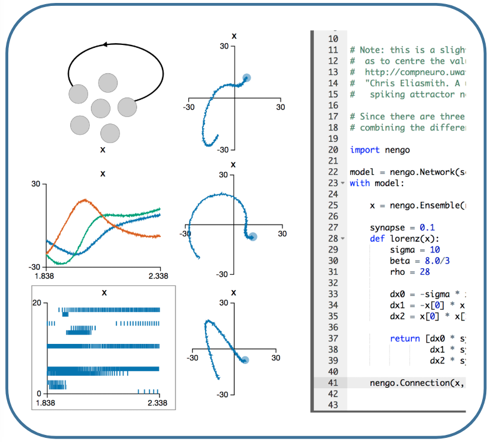
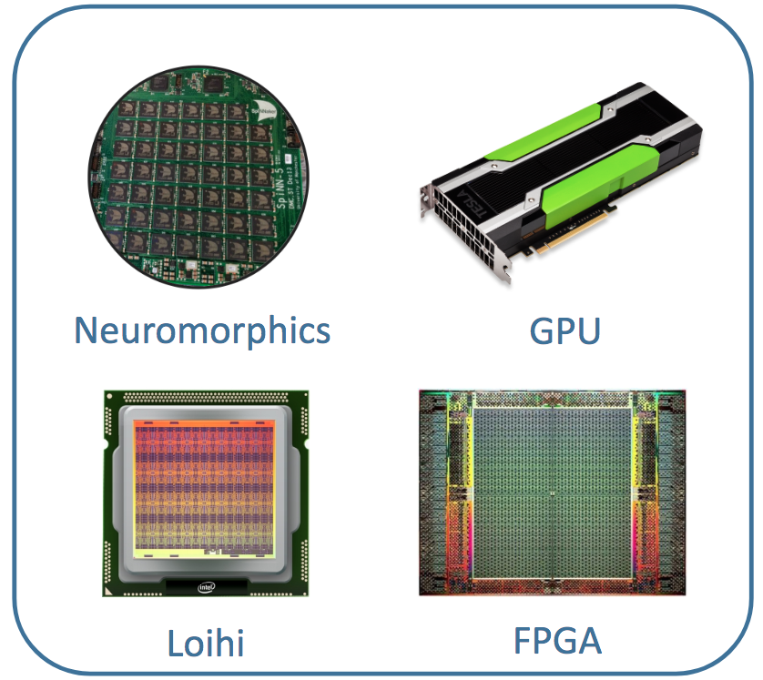

|    Neuromorphic application development
|
|           like never before.

**************************
The Nengo neural simulator
**************************

 Build, test, and deploy neural architectures

Features:
 - Spiking or traditional non-spiking models
 - Fully scriptable or GUI-based development
 - Highly customizable or use available modules
 - Tackle dynamic information processing
 - Easily exploit the latest hardware

.

 Join the Nengo community and learn the ropes

Resources:
 - Extensive :ref:`documentation <Documentation>`
 - Highly active `forum <https://forum.nengo.ai/>`_
 - Built-in tutorials
 - Read the `code <https://github.com/abr>`_

.. raw:: html

    <iframe width="560" height="315" src="http://www.youtube.com/embed/zGpwSeMtCQc?rel=0" frameborder="0" allowfullscreen></iframe>
