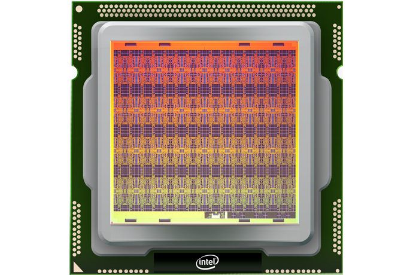
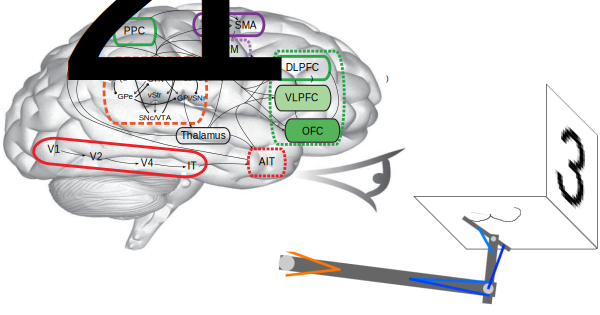

********
Overview
********

    Nengo is the leading multi-platform neuromorphic compiler and
    development environment.

Nengo is a graphical and scripting based Python package
for simulating large-scale neural networks.
Nengo can create sophisticated
spiking or non-spiking neural simulations
with sensible defaults in a few lines of code.

.. image:: http://appliedbrainresearch.com/img/gui-03.gif
   :width: 100%
   :alt: NengoGUI
   :align: center

Nengo is highly extensible and flexible.
You can define your own neuron types and learning rules,
get input directly from hardware,
build and run deep neural networks,
drive robots,
and even implement your model on
a completely different neural simulator
or neuromorphic hardware.

Among other things,
Nengo is used to implement networks for
deep learning, vision, motor control,
visual attention, serial recall, action selection,
working memory, attractor dynamics, inductive reasoning,
path integration, and planning with problem solving.

